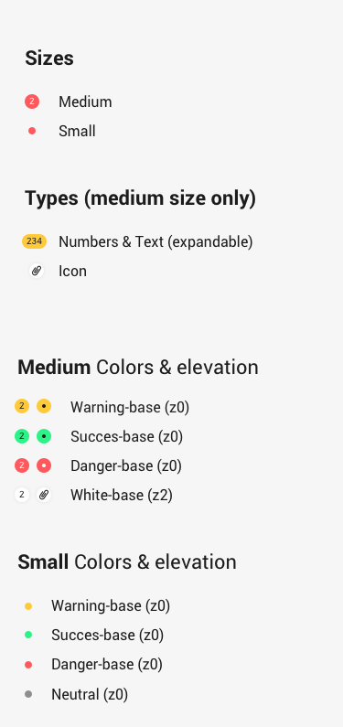
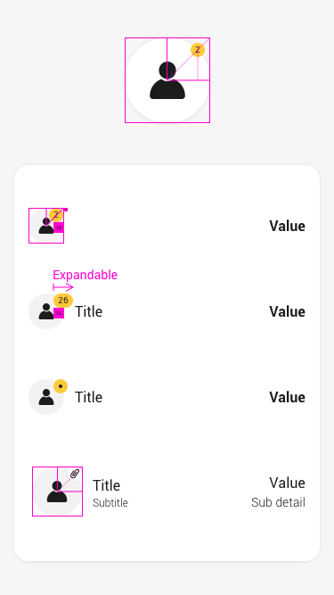
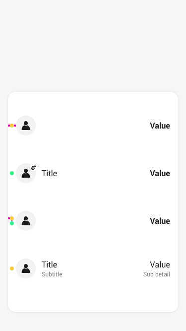
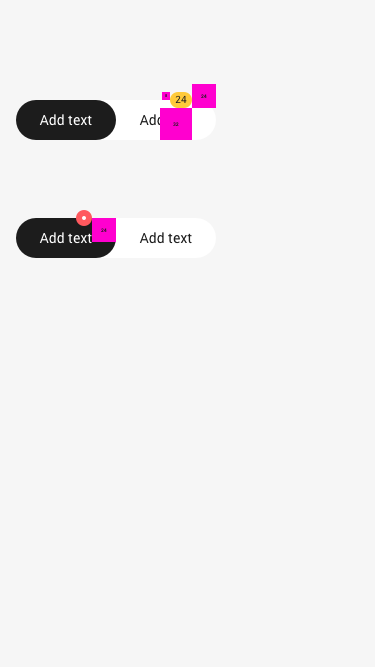
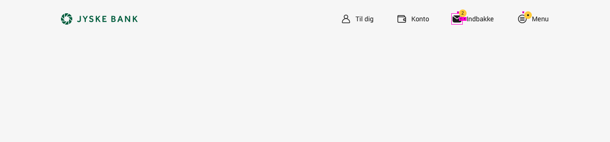

# Badge

<dl>
  <dt>## Definition list</dt>
  <dd></dd>

  <dt>Markdown in HTML</dt>
  <dd>Does *not* work **very** well. Use HTML <em>tags</em>.</dd>
</dl>

<dl>
  <dt>Definition list</dt>
  <dd>Is something people use sometimes.</dd>

  <dt>Markdown in HTML</dt>
  <dd>Does *not* work **very** well. Use HTML <em>tags</em>.</dd>
</dl>
# Rule 1
Description for rule 1.

    

        <h2>Good</h2>
        <pre><code class="language-c">int foo (void) 
{
    int i;
}
</code></pre>
    

    

        <h2>Bad</h2>
        <pre><code class="language-c">int foo (void) {
    int i;
}
</code></pre>
    

### Links

[Zeplin](https://zpl.io/br0wMQ7), [Cookbook](https://cookbook.kirby.design/home/showcase/badge)

Badges are inline block elements that appear on top of another component. Typically they contain a number or an icon and in certain usecases they can also use a text, although flags are often a better alternative when using text.
They can be used as a notification that there are additional items associated with an element and indicate how many items there are.
They can also indicate something that needs the users attention with or without text, e.g. a ‘new’-badge or dot-badge indicating a new feature in the menu.
Badges can also show icons to indicate a status on the associated element, e.g. a badge with an attachment icon on a transaction.
Badges are available in two sizes - medium and small. Medium badges kan be used with text, dot and icons. Small badges are only with color options and can be used to indicate a status on an element, e.g. a flagged transaction.
Badges are **decorative**, so they don’t have to be accessible; Our users expect the red color to be with a white text which is not accessible, but we are aware of that.

Badges have _no elevation_ unless its white. White badges are used on avatars which make the badge disappear. Thus it has a _z0_ elevation 

---

### Types

   *sæoihs* so oihoih soih oih oih soih soih oihsoihsoih ohosih oishoihsoihsoihoihsoih soihsoih soihsohsoihsohosh os |  |
| :---:| ---------:|

### Placement & Spec

æoidsisoisoisoijsdoij

### Heroes

