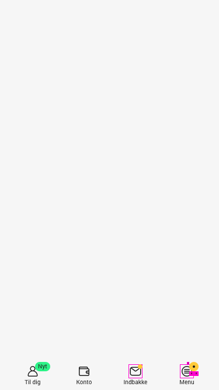

# Badge

Badges are inline block elements that appear on top of another component. Typically they contain a number or 
an icon and in certain usecases they can also use a text, although flags are often a better alternative when using text.

### Usage

### Anatomy

### Specs

### Color
Generalt bruger badge [kirby signal farver](https://zpl.io/br0wMQ7), for at fremhæve sig selv, og udskilde sig fra det overordnede design. 
Badge kan dog opstå med en anden baggrunds farve, hvis et badge vises på componenten [Avatar](https://zpl.io/br0wMQ7).

### Elovation
Badge har generalt ikke nogen elovation. Det eneste tidspunkt badge indholder elovation er når det optræder over på componenetet 
[Avatar](https://zpl.io/br0wMQ7).

### Size
Badge kommere i to størrelser, small og medium. 

## Use of badge

## Type of badges
<table>
    <tr>
        <td valign="top">
        This is some text, images text goes into here;) 
        </td>
        <td align="right" width="30%">
        
        </td>
    </tr>
</table>

<table>
    <tr>
        <td valign="top">
        This is some text, images text goes into here;) 
        </td>
        <td align="right" width="30%">
        
        </td>
    </tr>
</table>

### Links

[Zeplin](https://zpl.io/br0wMQ7), [Cookbook](https://cookbook.kirby.design/home/showcase/badge)

Badges are inline block elements that appear on top of another component. Typically they contain a number or an icon and in certain usecases they can also use a text, although flags are often a better alternative when using text.
They can be used as a notification that there are additional items associated with an element and indicate how many items there are.
They can also indicate something that needs the users attention with or without text, e.g. a ‘new’-badge or dot-badge indicating a new feature in the menu.
Badges can also show icons to indicate a status on the associated element, e.g. a badge with an attachment icon on a transaction.
Badges are available in two sizes - medium and small. Medium badges kan be used with text, dot and icons. Small badges are only with color options and can be used to indicate a status on an element, e.g. a flagged transaction.
Badges are **decorative**, so they don’t have to be accessible; Our users expect the red color to be with a white text which is not accessible, but we are aware of that.

Badges have _no elevation_ unless its white. White badges are used on avatars which make the badge disappear. Thus it has a _z0_ elevation 

---

### Types

   *sæoihs* so oihoih soih oih oih soih soih oihsoihsoih ohosih oishoihsoihsoihoihsoih soihsoih soihsohsoihsohosh os |  |
| :---:| ---------:|

### Placement & Spec

> Blockquotes are very handy in email to emulate reply text.
>
>sssssssssssss  dsh sth xg hdth

> This line is part of the same quote.

### Heroes

